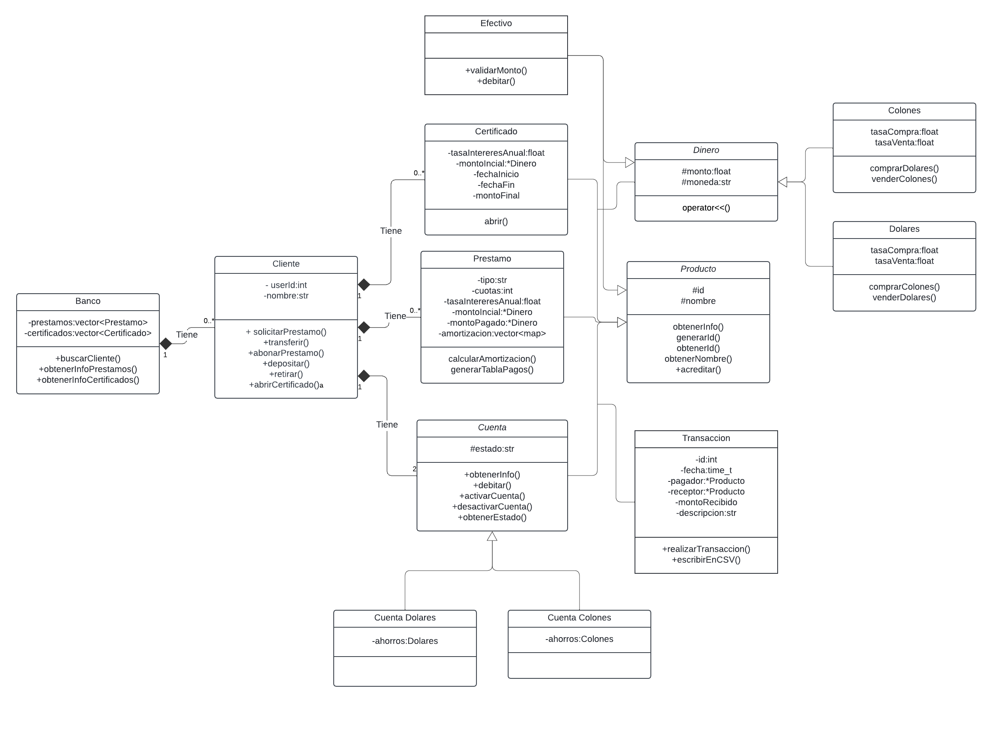
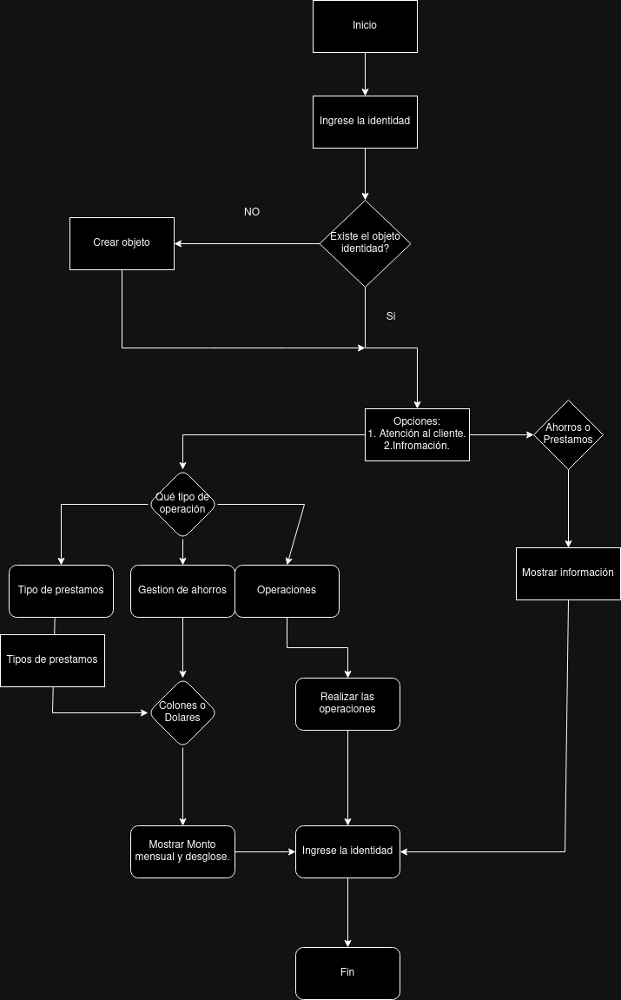
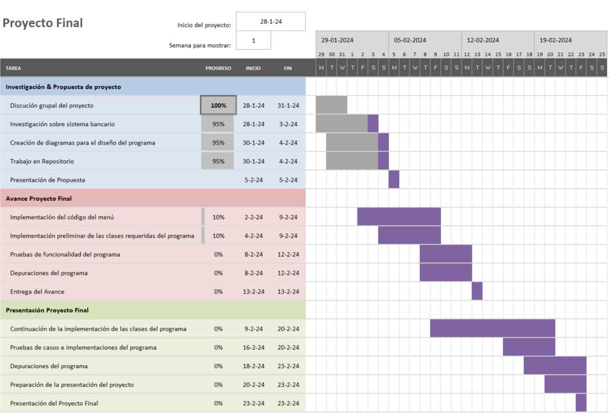

# Investigación del proyecto #
En esta sección se recolectarán las ecuaciones necesarias para realizar el cálculo de créditos. ¿Cuánto será lo que debe pagar mensualmente? ¿A qué plazos? A qué tasas de interés?. Así como la solicitud de Certificados de Depósito a Plazo (CDP) y poder consultar el dinero disponible cuando termine el plazo.

## Préstamos personales, prendarios e hipotecarios: ##
Se diferencian en la principalmente en los activos que se toman como garantía:
- Préstamo personal: no requieren una garantía específica. Únicamente se investiga la solvencia crediticia del cliente.
- Préstamo prendario: requiere un bien tangible como garantía. Usualmente el bien para el que se solicita el préstamo
- Préstamo hipotecario: se utiliza un bien inmueble de garantía.

El pago mensual de estos préstamos se calcula con la fórmula:

$$ A = P \times \frac{r(1+r)^n}{(1+r)^n - 1} $$

Donde $P$ es el préstamo, $r$ la tasa de interés por periodo y $n$ el número de periodos. En este pago se contempla el pago del principal y el pago de intereses. Los intereses se pueden calcular con la fórmula:

$$
I = r\times(P - S)
$$

Donde $S$ es lo que se ha pagado hasta el momento.
## Certificados de Depósito a Plazo (CDP): ##
Es un depósito que se pacta a un periodo de tiempo, el cual es acordado entre el
cliente y el banco. La tasa de interés se establece en base al monto del depósito y
el plazo. Este tipo de depósitos no permite retiros, ni incrementos de saldos y para
poder disponer del dinero el cliente debe esperar hasta la fecha de vencimiento del
depósito.
Para calcular el monto total al finalizar un periodo de años para un Certificado de Depósito a Plazo (CDP), se emplea la siguiente ecuación:

$$ A = P(1 + R)^r $$

Donde:

P es el monto mensual.

R = tasa de interés anual/12 

r = 12*plazo en meses

R = tasa de interés anual / 12 

r = 12 * plazo en meses

# Diseño

Los elementos principales del programa son la clase transacción y la clase producto. Esta última es una clase virtual que nos permitirá realizar transacciones entre cualquiera de sus derivados. En cada clase definiremos que significa transferir dinero desde o hacia esa entidad. Por ejemplo, si un préstamo recibe dinero significa que se le está abonando. Esto nos permitirá realizar cualquier movimiento de dinero.

Por otro lado para alamacenar la información relativa a préstamos, certificados y usuarios, se utiliza la estructura mostrada. El banco guarda en un contenedor los usuarios y los usuarios guardan préstamos. Esto facilita encontrar certificados y préstamos, pero obliga al usuario a ingresar tanto el ID del dueño del préstamo como del préstamo. Una posible solución es almacenar de alguna forma el ID del usuario en el ID del préstamo pero esto no se implementará en este caso.
## Funcionamiento ##

El sistema inicia pidiendo el número de identidad. En el caso de que no se encuentre en el sistema, se procede a crear: se le mostrará una ventana indicándole que su ID no se encuentra en la base de datos y se preguntará si desea ingresar su ID. En este caso, ID sería la cédula del cliente. Este ID es único.

Después de ingresar al sistema, se le mostrará el tipo de acción que desee realizar: Atención al cliente o Información.

En el caso de que escoja Atención al cliente, el sistema mostrará tres opciones donde se encuentra: Prestamos, Gestión de Ahorros, Operaciones.

En la sección de Prestamos, el cliente, podrá tramitar tres distintos tipos de préstamos: personales, prendarios e hipotecarios. Cada uno con un plan de pago que varía dependiendo de el dinero prestado y el plazo a pagar. Estos plazos y monto a prestar ya están predefinidos por la identidad bancaria. Para finalizar, una vez realizado el trámite, se le mostrará la opción de obtener la tabla mediante valores personalizados de monto, cantidad de cuotas y la tasa de interés.

En la sección de Gestión de Ahorros, el cliente podrá gestionar dos cuentas de ahorros con la identidad bancaria, una cuenta en dólares y la otra en colones. Así como certificados de depósito a plazo (CDP).

En la sección de operaciones, el cliente podrá realizar diversas operaciones. Tales como depósitos, retiros transferencias entre cuentas dirigidas a otros clientes (de colones a dólares y viceversa), abonos a préstamos tanto propios como de otras personas, etc.

Ya cubierta la sección de Atención al cliente, el sistema lo devolverá al menú principal. Una vez ahí y suponiendo de que el cliente haya hecho sus operaciones, prestamos, etc; correctamente, podrá acceder a la opción de información. Esta sección se encarga de mostrarle sus estados de cuenta: ahorros, prestamos con tablas para un análisis más cómodo. De esta forma el cliente puede hacer un seguimiento de sus préstamos y ahorros.

Para finalizar el sistema contará con una opción de salida que permitirá abandonar el sistema en caso de que ya no se use.

# Cronograma del proyecto #

Para establecer el cronograma del proyecto se utiliza la herramienta del Diagrama de Gantt, la cual es una herramienta que permite organizar, controlar y planificar proyectos muy usado en la industria, además de que al ser una herramienta visual es de fácil uso y comprensión.

