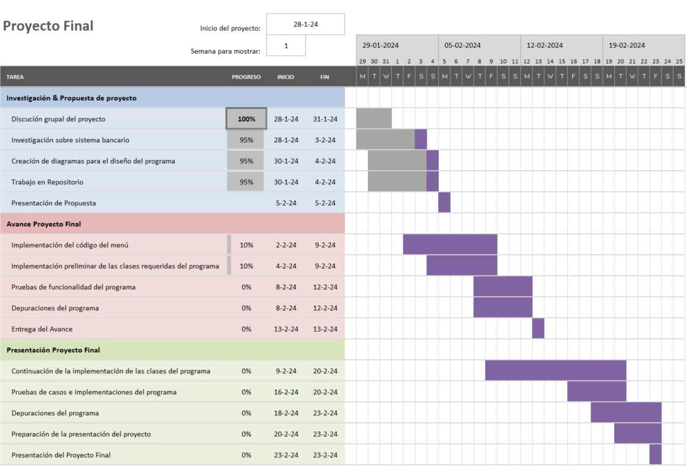

# Investigación del proyecto #
En esta sección se recolectarán las ecuaciones necesarias para realizar el cálculo de créditos. ¿Cuánto será lo que debe pagar mensualmente? ¿A qué plazos? A qué tasas de interés?. Así como la solicitud de Certificados de Depósito a Plazo (CDP) y poder consultar el dinero disponible cuando termine el plazo.

## Préstamos personales, prendarios e hipotecarios: ##
Se diferencian en la principalmente en los activos que se toman como garantía:
- Préstamo personal: no requieren una garantía específica. Únicamente se investiga la solvencia crediticia del cliente.
- Préstamo prendario: requiere un bien tangible como garantía. Usualmente el bien para el que se solicita el préstamo
- Préstamo hipotecario: se utiliza un bien inmueble de garantía.

El pago mensual de estos préstamos se calcula con la fórmula:

$$ A = P \times \frac{r(1+r)^n}{(1+r)^n - 1} $$

Donde $P$ es el préstamo, $r$ la tasa de interés por periodo y $n$ el número de periodos. En este pago se contempla el pago del principal y el pago de intereses. Los intereses se pueden calcular con la fórmula:

$$
I = r\times(P - S)
$$

Donde $S$ es lo que se ha pagado hasta el momento.
## Certificados de Depósito a Plazo (CDP): ##
Es un depósito que se pacta a un periodo de tiempo, el cual es acordado entre el
cliente y el banco. La tasa de interés se establece en base al monto del depósito y
el plazo. Este tipo de depósitos no permite retiros, ni incrementos de saldos y para
poder disponer del dinero el cliente debe esperar hasta la fecha de vencimiento del
depósito.
Para calcular el monto total al finalizar un periodo de años para un Certificado de Depósito a Plazo (CDP), se emplea la siguiente ecuación:

$$ A = P(1 + R)^r $$

Donde:

P es el monto mensual.

R = tasa de interés anual / 12 

r = 12 * plazo en meses

# Cronograma del proyecto #

Para establecer el cronograma del proyecto se utiliza la herramienta del Diagrama de Gantt, la cual es una herramienta que permite organizar, controlar y planificar proyectos muy usado en la industria, además de que al ser una herramienta visual es de fácil uso y comprensión.

